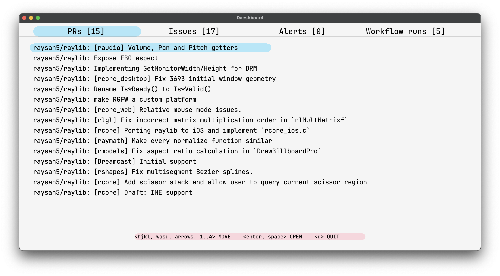

# Dashboard

A desktop dashboard built with [raylib](https://www.raylib.com/).



## Data sources

- Alertmanager alerts
- Github repositories
  - PRs
  - Issues
  - Workflow runs

## Configuration

Put something like this in `./config.json`:

```json
{
  "repos": ["github.mycompany.com/internal/affairs", "raysan5/raylib"],
  "alerts": {
    "server": "alertmanager.example.com",
    "receiver": "myreceiver"
  }
}
```

## Usage

If you want to get data from private repositories on github.com, you need to set the `GH_TOKEN` environment variable. If your repos are on github.com, set the value to your github token. If you want to get data from enterprise servers, then set it to `<hostname>:<token>`. Here are some examples:

```sh
GH_TOKEN=github-com-token
GH_TOKEN=github.mycompany.com:company-token
GH_TOKEN=github.com:github-com-token,github.mycompany.com:company-token
```

So if you have repos both on github.com and on github.mycompany.com, use a comma-separated list as in the last example. Then run

```sh
GH_TOKEN=replace-me go run ./main.go
```
